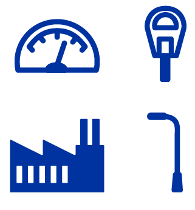
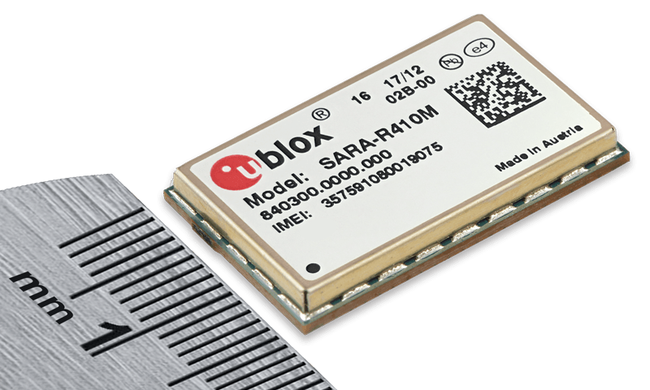
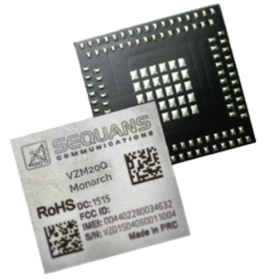
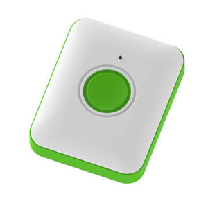
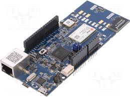
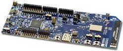
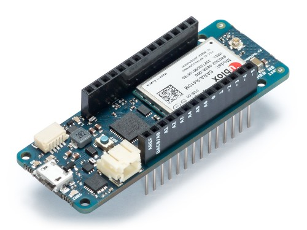

# Telenor Start IoT Overview

> Reading time: 45 minutes

The Telenor Start IoT technical platform consists of several different elements. First of all, there is the LTE cellular network with the new IoT dedicated networks (protocols) that utilizes the existing LTE cellular network infrastructure. The first two chapters will briefly describe the new dedicated IoT networks and how data is transferred from the cellular network to IP based networks (Internet).

Secondly, there is the IoT devices themselves and such devices can transfer data to IP based networks in many different ways. Chapter three discusses this briefly and also touch upon security issues.

Thirdly, there is the IoT platform, or platform elements. An IoT platform tries to handle features that all IoT services will need and in many cases it is a good idea to use a platform as a basis when going about developing new IoT services. It is of course possible to do without a platform, but then you will have to handle everything the platform is designed to handle for all new IoT services that you would like to create and we do believe that this is not a good idea. Chapter four will briefly describe what platforms can do and how to include them in your IoT service.

## Contents

  1. [4G LTE Cellular IoT Networks](#1-4g-lte-cellular-iot-networks)
     1. [Coverage](#coverage)
     2. [NB-IoT (NB1)](#nb-iot-nb1)
     3. [LTE-M (Cat M1/M1)](#lte-m-cat-m1m1)
  2. [APN: Getting Data Out of the Cellular Network to an IP Endpoint](#2-apn-getting-data-out-of-the-cellular-network-to-an-ip-endpoint)
     1. [Public APN](#public-apn)
     2. [Private APN](#private-apn) 
  3. [Cellular LPWAN Modems, Devices and Development Kits](#3-cellular-lpwan-modems-devices-and-development-kits)
     1. [LPWAN Cellular Modems](#lpwan-cellular-modems)
     2. [IoT Devices](#iot-devices)
     3. [LPWAN Development Kits](#lpwan-development-kits)
  4. [IoT Platforms: Telenor Managed IoT Cloud and IoT Gateway](#4-iot-platforms-telenor-managed-iot-cloud-and-iot-gateway)
     1. [Telenor Managed IoT Cloud (MIC)](#telenor-managed-iot-cloud-mic)

## 1. 4G LTE Cellular IoT Networks

### Coverage

Telenor has the world's fastest mobile network. The 4G network is now also optimised for connecting IoT devices. The technology enabled in the 4G network is called Narrow Band IoT (a.k.a. NB-IoT or NB1) and LTE Cat M1 (a.k.a. M1 or LTE-M). Both of these networks (protocols) provides very good indoor, outdoor and underground coverage. 

Telenor offers IoT coverage across Norway, including Svalbard. IoT at 4G is the only technology that will provide full national coverage in the short and long term, and global (international) coverage within a few years.

### NB-IoT (NB1)

NB-IoT is ideal for battery-powered devices that occasionally transmit data over the web. This makes the battery life very long, in some cases up to 10 years. NB-IoT tracking is an important area of ​​IoT, and can be practically applied to just about anything that moves. Not just animals but shipping, containers and means of transport. NB-IoT is suitable when sending data sporadic and when lowest possible power consumption is required.

NB-IoT use cases (source: Nordic Semiconductor).

### LTE-M (Cat M1/M1)

LTE-M is suitable for active sensors requiring higher speeds and greater bandwidth, while also requiring good battery life and / or better penetration coverage. LTE-M is tomorrow's version of today's 2G and 3G solutions. LTE-M subscription supports LTE-M and LTE traffic. LTE-M supports SMS, but not yet VoLTE. LTE-M is suitable for real time mobility cases or when streaming of data is required.

LTE-M (Cat M1) use cases (image source: Nordic Semiconductor).

You can find a lot of information on the Internet about the difference between LTE-M and NB-IoT. Here is a link to a very short overview provided by Ericsson: https://www.ericsson.com/en/blog/2019/2/difference-between-NB-IoT-CaT-M1

## 2. APN: Getting Data Out of the Cellular Network to an IP Endpoint

The 4G LTE network transmits data from your devices to IP based endpoints. In the 4G architecture it is the "Public Data Network Gateway" (PGW) that transforms data from the cellular network to IP based networks. It is possible to set up IP access points from the PGW in many different ways. All the different access points are given names, this is the Access Point Name (APN). It is the cellular operator that creates and manages the access points in the PGW. Some APN's are public, meaning that any device is allowed to send traffic through the access point and some are private (restricted). Some APN's only allow forwarding of traffic to specific IP endpoints and some allow forwarding to any IP endpoint. Some APN's use IPsec tunnels to forward traffic encrypted to one specific endpoint and some APN's do not. We will not get into the details here. In Telenor Start IoT we use both public APN's and private APN's, sending data securely to a specific endpoint. More about that later.

The figure shows a simplified overview of our NB-IoT/LTE-M network architecture. CIoT RAN is what most people call a base station, the PGW is the point in the cellular network where the data leaves the operator network and enters an IP network (PDN). The CIoT service is your service endpoint or an IoT platform endpoint (e.g. Telenor Managed IoT Cloud platform that is part of the Telenor Start IoT offering).

### Public APN

A public APN is a gateway to IP networks that allows any device with an IoT data SIM card to connect and forward traffic to IP based endpoints. A device that is trying to connect to an APN will first of all send an authentication/authorisation request. For an open APN this implies that when the device is turned on, [Radius](https://en.wikipedia.org/wiki/RADIUS) requests from any device is granted. Radius is the authentication/authorisation protocol used in 4G IoT data networks. The Telenor Start IoT public APN is called **telenor.iot**. Note that it may have a different name across Telenor units.

**Important: when your traffic leaves the open APN it is no longer protected (encrypted) and if you need to secure your traffic you will have to handle it end-to-end yourself.**

### Private APN

A private APN is usually a paid service that companies can purchase from the network operator. The company can choose the name of the APN and it is also possible to secure the traffic when it leaves the cellular network using VPN tunnels (i.e. IPsec). The Radius server can usually either be hosted by the network operator or by the company purchasing the private APN. The Radius server only allows devices owned by the company to connect (based on the IMSI/IMEI number). In Telenor Start IoT we have done this for you and the traffic from the **telenor.iotgw** APN is securely forwarded to IoT Gateway. IoT Gateway is a platform element that is part of our demo IoT platform.

## 3. Cellular LPWAN Modems, Devices and Development Kits

In the context of IoT we often talk about modems, devices and development kits. The differences between these are often confused with one another. This chapter gives a quick overview of what they are, their functionality and usage.

### LPWAN Cellular Modems

In day to day speech, a cellular modem is a device that allows a personal computer or a router to receive Internet access via a mobile broadband connection instead of using telephone or cable television lines. In our context however, referring to a modem means the part on the circuit board that handles the cellular connectivity. Traditionally the modem has always been a separate entity on the circuit board but today we are also starting to see the modem integrated together with an [MCU](https://en.wikipedia.org/wiki/Microcontroller) or CPU and other components into a System on a Chip (SoC). A cellular Low Power Wide Area Network (LPWAN) modem is a modem that supports either NB-IoT or LTE-M, or both. The Ublox R410 and the Sequans Monarch (see images) are examples of modems that supports both while the UBlox N210 is an example of a modem which only supports NB-IoT. The Mediatec MT2625 and Nordic nrF9166 are examples of NB-IoT only (Mediatec) and NB-IoT/LTE-M (Nordic) LPWAN SoC's. LPWAN cellular modems are used as one of the building blocks for IoT devices and IoT development kits.

UBlox SARA R410M modem.

Sequans Monarch NB-IoT/LTE-M (Cat M1) modem.

### IoT Devices

A cellular IoT device naturally includes a cellular modem (or SoC) but in addition other components are usually added to the [PCB](https://en.wikipedia.org/wiki/Printed_circuit_board) as well. Cellular IoT devices are often specifically designed to meet the needs for a particular IoT use case. In principle, all types of equipment that includes network connectivity can be thought of as an IoT device. The Telenor Start IoT offering is however focusing on LPWAN IoT and this limits the fitting use cases. LPWAN IoT devices usually consists of at least a LPWAN modem, power circuitry, sensors and actuators relevant for the use case in questions. Many of the LPWAN IoT devices are powered by batteries.

The Mictrack NB-IoT/LTE-M (Cat M1) GPS tracking device.

The Q Free NB-IoT parking space sensor.

### LPWAN Development Kits

Development kits have at least two meanings related to IoT. Modem or SoC vendors often create development kits that customers can use in order to experiment with or do research on how the particular modem or SoC performs. These development kits are usually relatively large and may include a lot of stuff intended for experimental and or research purposes (e.g. different types of antennas, multiple power circuits, on-board sensors, USB plugs, Ethernet plugs etc.). These development kits are usually targeted for hardware developers. The UBlox N211 and the nrf9160 development kits are examples of this type of development kits.

Another type of common development kits are units targeted at developers or makers that most of all would like to experiment with software, or would like to create relatively small prototypes for an IoT device. The purpose of such a prototype is often to create everything around the device itself that you need to create an IoT service (e.g. Web or mobile phone based applications, dashboards, etc.). This is the kind of development kit that we are providing as part of the Telenor Start IoT offering. These development kits are also a great starting place to play around with the technology and have tons of fun. With a proper casing the prototypes might even be suited for long term testing of vital characteristics of your IoT service (e.g. power consumption, suitability of chosen sensors, etc.). The Arduino MKR NB 1500 development kit is an example of this type of development kit and is one of the kits we are currently using in the Telenor Start IoT offering.

UBlox N211 NB-IoT modem development kit.

Nordic nrf9160 SoC development kit.

Arduino MKR NB 1500 development kit.

## 4. IoT Platforms: Telenor Managed IoT Cloud and IoT Gateway

If you have followed the previous chapters in this article you now have an understanding of how data is transmitted over a cellular network and transferred to an IP network. But then what? Basically you have two options, either handle everything you need yourself or use an IoT platform that handles all the basic functionality that (all) your IoT services will need. Instead of using a lot of time to do all the needed coding yourself, or hiring software developers to build everything in-house, you could instead use an IoT platform to get up and running quickly and more cost-effectively. As part of the Telenor Start IoT offering we have included a commercially available platform called Telenor Managed IoT Cloud (abbreviated MIC) and one optional platform element (IoT Gateway). 

MIC is already a commercial offering, allowing you to migrate solutions you create as part of your Telenor Start IoT exploration to a commercial setup provided by Telenor. The MIC setup, when you use the private telenor.iotgw API, also uses IoT Gateway as a (hidden) platform element.

### Telenor Managed IoT Cloud (MIC)

Telenor Managed IoT Cloud is an end-to-end solution that works with any type of connectivity technology. Telenor Managed IoT Cloud is a secure cloud platform for device and data management that generates valuable and useful insights into your connected products. It provides the building blocks you need to connect your product, collect and store all product data and extract value and insights from that data.

Managed IoT Cloud in summary:

  * Shorten time to market by leveraging a proven and reliable end-to-end solution.
  * Reduce risk and cost by selecting a scalable and secure service instead of building and operating your own infrastructure.
  * Keep focus on customer experience and business development rather than technology.

As part of the Telenor Start IoT offering we will grant you a fully functional, free of charge account on MIC limited to connecting at least 10 devices.
